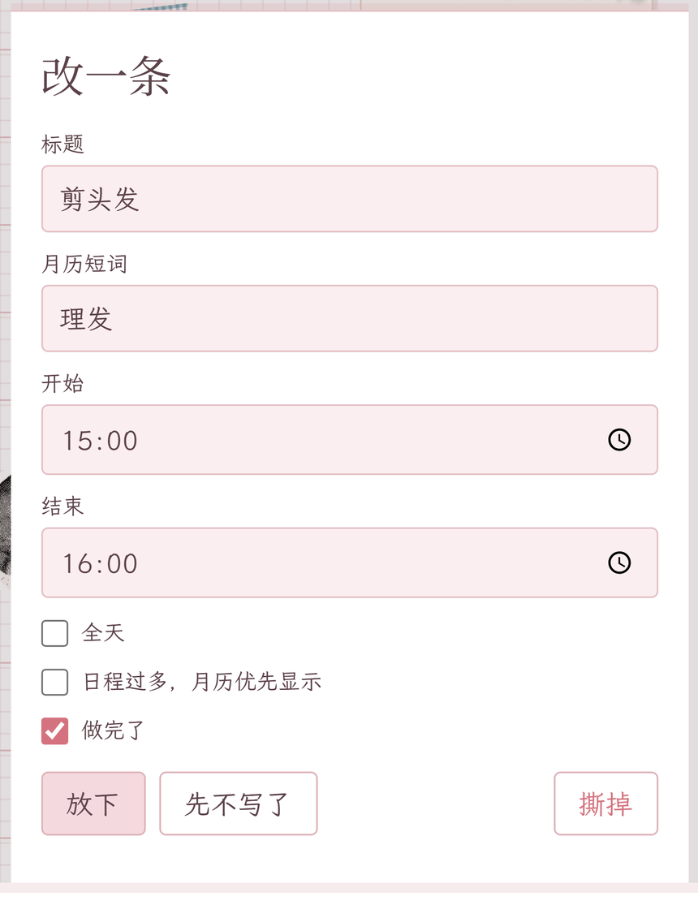

# 一本和 AI 共用的手帐日历

[English](README.en.md) · [Agent / MCP integration](docs/agent-integration.md)

> **先看这里：这是一个以网页为主的 fork。**
>
> 本仓库 fork 自 [KKarsyline/shared-page](https://github.com/KKarsyline/shared-page)。上游主要提供 iOS 客户端；这个版本沿用后端和 MCP 日历接口，重新做了桌面浏览器和局域网手机浏览器使用的网页端。
>
> 下面先把上游和当前版本的差异列清楚，再介绍当前版本怎么运行、网页能做什么，以及 Agent 如何接入。

## 当前版本和上游的差异

| 能力 | 上游 | 当前版本 |
|---|---|---|
| FastAPI + SQLite 后端 | 有 | 沿用 |
| MCP `calendar` 工具和六个 action | 有 | 沿用 |
| `list` / `see` / `create` / `update` / `delete` / `comment` | 有 | 沿用 |
| 生日、纪念日和节日播种 | 有 | 沿用并保留 `rail` 配置 |
| iOS 客户端 | 有 | 当前版本不包含 |
| 原生客户端推送 | 有（随 iOS 端） | 当前版本不提供 |
| iOS 桌面小组件 | 有 | 当前版本不包含 |
| Vision 抠图并制作可复用贴纸 | 有 | 当前版本不包含 |
| 月视图里的贴纸缩略图 | 有 | 当前版本不包含 |
| 本地网页端 | 无 | 新增 |
| 桌面浏览器和同一局域网内的手机浏览器访问 | 无 | 新增 |
| 网页月视图、日视图、事件、便签、贴纸、拍立得 | 无 | 新增 |
| 网页贴纸拖动、删除、旋转、缩放和层级调整 | 无 | 新增 |
| 照片上传、贴纸 / 照片布局保存和整页渲染 | 无 | 新增 |
| `done`、`keyword`、`pin`、年度纪念日 rail、过期页面提示 | 无 | 新增 |
| `seed_demo.py` 和 `seeds.example.json` | 无 | 新增 |

需要原生 iOS 客户端、桌面小组件或上游的 Xcode 流程时，请看[上游仓库](https://github.com/KKarsyline/shared-page)。当前仓库的使用方式以网页端为准。

## 它是什么

Shared Page 是一本手帐风格的共享日历。一个人和一个 AI agent 可以共同阅读和维护同一本日历里的安排、便签和页面记录。

网页端负责纸面上的阅读和编辑；MCP 让接入的 Agent 可以：

- 读取一段时间内的安排；
- 查看某一天的文字记录和最近一次整页渲染图；
- 创建、修改或删除事件；
- 在某一天贴便签，并更新便签的点赞状态。

网页和 MCP 共用同一个 SQLite 数据库。服务默认使用本机文件，不需要账号系统。


_左是月视图，右上角是年度纪念日；右是 8 月 25 日的纸面，有两边的便签、贴纸和拍立得。_

## 快速开始

### 环境

- Python 3.10 或更高版本；建议 Python 3.12。
- 依赖安装在 `server/requirements.txt` 中。
- Windows 所需的 IANA 时区数据包 `tzdata` 已包含在依赖文件里，不需要另行安装。

### macOS / Linux / Git Bash

```bash
cd server
python -m venv .venv
.venv/bin/python -m pip install -r requirements.txt
.venv/bin/python -m uvicorn web_app:app --host 127.0.0.1 --port 8787
```

### Windows PowerShell

```powershell
cd server
python -m venv .venv
.\.venv\Scripts\python.exe -m pip install -r requirements.txt
.\.venv\Scripts\python.exe -m uvicorn web_app:app --host 127.0.0.1 --port 8787
```

打开 <http://127.0.0.1:8787> 就能看到网页。

服务默认以 `server/` 为工作目录，数据位于：

```text
server/data/calendar.db
server/data/pages/*.png
server/data/placed/*.json
server/data/photos/*.jpg
```

可以通过环境变量改变数据库、页面图片和时区：

```text
CALENDAR_DB=./data/calendar.db
CALENDAR_PAGES_DIR=./data/pages
CALENDAR_TZ=Asia/Shanghai
```

`.env.example` 是变量模板；应用不会自动读取 `.env`。使用模板时，请先把变量导出到当前 shell，再启动服务。

### 手机访问

如果电脑和手机在同一个可信局域网内，可以监听所有网卡：

```bash
.venv/bin/python -m uvicorn web_app:app --host 0.0.0.0 --port 8787
```

然后在手机浏览器打开电脑的局域网地址，例如 `http://192.168.x.x:8787`。

### 探活

```text
GET http://127.0.0.1:8787/api/v1/calendar/ping
```

## 网页端

网页已有中文 / English 界面。按钮和编辑提示可切换；月份、星期和 `tap a day to open it` 保持英文纸面。页面上的 **中 / EN** 第一次按浏览器语言，选过以后记在这台浏览器里。截图可用 `?lang=en` 或 `?lang=zh` 锁死语言。若服务设了钥匙，钥匙页也可以切换，刚输入的钥匙会保留。

### 月视图和日视图

- 月视图显示日期、事件短词、今天标记、年度纪念日 rail 和未查看变化提示；
- 日视图显示小时轴、全天事件、跨天色带、便签、贴纸和拍立得；
- 事件可以设置短词，也可以标记“做完了”；完成的事件仍留在时间轴上并显示划线；
- 事件可以设置“优先显示”，用于月历里日期较拥挤时的显示取舍；
- `birthday` 和 `anniversary` 使用纪念日样式，`period` 使用横带样式；
- 月历右上角最多显示三条被钉住的生日或纪念日。




网页默认使用 `USER` 和 `ASSISTANT` 作为两侧标签，也可以通过环境变量改成自己的称呼。播种产生的固定日期使用 USER 侧的纸面颜色，同时在数据中保留 `source: seed` 作为来源标记。

### 便签

在日视图中可以给当天贴便签。便签是放在当天纸面上的短提醒，不是每轮聊天自动生成的记录：正式安排写成事件；只有在人明确要求贴提醒，或已经约定的定时任务触发时，Agent 才创建便签。

网页点击“贴一张便签”后，会立刻创建一张写着“写点什么”的便签并进入编辑；文字在失焦时保存，`×` 表示撕掉这张便签。MCP 的 `comment` 也用于在得到明确请求时创建便签。便签可以编辑、点赞或撕掉；MCP 还支持把便签挂到某条事件上，但网页端按日期摆放便签，不另外显示这层绑定关系。

纸面便签大约适合两行、18 个中文字符。较长的内容可以拆成多张，完整文字仍保存在数据库中。

### 贴纸和拍立得

- 贴纸可以拖动、删除、旋转、缩放；点击或移动后会提到最前；
- 当前网页端贴纸栏包含网点猫、老相机、咖啡杯、票根和红心；
- 从本机选择的照片会上传为 JPEG，并放进拍立得相框；
- 照片和贴纸的位置会保存到当天的布局文件中。

### 整页渲染图

当天内容发生变化后，通过网页端导航离开日视图时，网页会把当天纸面渲染成 PNG。MCP 的 `see` 可以读取最近一次成功渲染的图片，以及数据库中的文字记录。

整页图是快照，不是实时画面。还没有成功渲染过的日期，`see` 仍然可以返回文字。

### 页面变化提示

如果同一本日历被另一台浏览器、手机或 Agent 改动，当前页面会提示先刷新，再继续编辑。

## MCP 接入

完整的英文接口说明见 [`docs/agent-integration.md`](docs/agent-integration.md)。MCP server 有两种运行方式：

```bash
cd server
.venv/bin/python mcp_server.py
.venv/bin/python mcp_server.py --http --host 127.0.0.1 --port 8788
```

Windows 把 `.venv/bin/python` 换成 `.venv\Scripts\python.exe`。

六个 action 是：

```text
list · see · create · update · delete · comment
```

MCP 和网页服务通过 `CALENDAR_DB` 共用同一个 SQLite 文件。MCP 的 HTTP 入口是 `/mcp`，默认监听 `127.0.0.1:8788`。

如果设置了 `CALENDAR_TOKEN`，受保护的网页数据接口使用下面的请求头：

```text
X-Calendar-Token: <your token>
```

## 可选模块

### 每年都过的日子

`server/seeder.py` 可以按公历播种生日、纪念日和节日：

```json
[
  {"month_day": "03-15", "type": "birthday", "title": "生日"},
  {"month_day": "06-01", "type": "anniversary", "title": "纪念日", "rail": true},
  {"month_day": "12-25", "type": "holiday", "title": "节日"}
]
```

通过 `CALENDAR_SEED_FILE` 指向 JSON 文件，通过 `CALENDAR_SEED_YEARS` 设置播种年数。重复运行不会重复创建相同的种子事件。

想看示范数据时，使用单独的数据库：

```bash
cd server
CALENDAR_DB=./data/demo-calendar.db .venv/bin/python seed_demo.py
```

## 测试

```bash
cd server
python -m unittest discover -s tests -t .
```

测试只覆盖本地代码，不需要联网或模型服务；运行前先安装 `server/requirements.txt` 中的依赖。

## 数据与许可

备份时请一起复制：

- `CALENDAR_DB` 指向的 SQLite 文件；
- `CALENDAR_PAGES_DIR` 指向的整页图目录；
- SQLite 文件所在目录下的 `placed/` 和 `photos/`。

代码使用 MIT License。原作者版权声明和许可条件见根目录 [`LICENSE`](LICENSE)。网页前端、网页适配和相关修复沿用 MIT 许可；字体、图标和贴纸素材的具体许可与出处见 [`licenses/`](licenses/)。

- 上游仓库：<https://github.com/KKarsyline/shared-page>
- 本仓库：<https://github.com/teresakl/shared-page>
